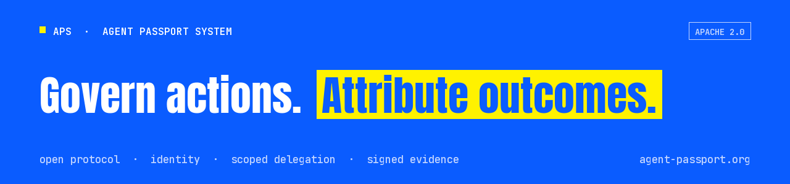

# Agent Passport System

An open protocol and tools for verifiable agent authority. APS combines cryptographic identity, scoped delegation and signed evidence for agents acting on behalf of people and organizations. Enforcement applies at the boundaries where APS checks are integrated.

[Website](https://agent-passport.org) · [Individual IETF Internet-Draft](https://datatracker.ietf.org/doc/draft-pidlisnyi-aps/) · [TypeScript quickstart](https://github.com/agent-passport-system/agent-passport-system#readme)

## Choose a starting point

| Your task | Start here |
|---|---|
| Build with APS in TypeScript | [TypeScript SDK](https://github.com/agent-passport-system/agent-passport-system) · `npm install agent-passport-system` |
| Build with APS in Python | [Python SDK](https://github.com/agent-passport-system/agent-passport-python) · `pip install agent-passport-system` |
| Use APS through MCP | [MCP server](https://github.com/agent-passport-system/agent-passport-mcp) · `npx agent-passport-system-mcp` |
| Evaluate requested agent actions | [Gateway](https://github.com/agent-passport-system/agent-passport-gateway), returning permit or deny with optional signed evidence |
| Build with APS in Go | [Go SDK](https://github.com/agent-passport-system/agent-passport-go) |
| Verify APS artifacts in Rust | [Rust verifiers](https://github.com/agent-passport-system/agent-passport-rust) |
| Study changes to agent authority | [Authority lifecycle research](https://github.com/agent-passport-system/agent-authority-lifecycle) |

## Reference implementations and demos

| System | Work in this organization |
|---|---|
| NVIDIA OpenShell | [Reference middleware](https://github.com/agent-passport-system/aps-openshell-reference-middleware) exercising ancestor revocation checks before upstream HTTP dispatch on the tested relay path |
| 1Password | [Demo](https://github.com/agent-passport-system/aps-1password-demo) combining a runtime key held in 1Password with APS authority checks at the integrated execution boundary |
| ClickHouse | [Signed receipts](https://github.com/agent-passport-system/aps-clickhouse-receipts) and [MCP delegation](https://github.com/agent-passport-system/aps-clickhouse-mcp-delegation) |
| x402 | [Reference composition](https://github.com/agent-passport-system/aps-x402-composition) combining delegation, payment and receipts |
| OpenClaw | [APS trust verification plugin](https://github.com/agent-passport-system/openclaw-plugin-aps), with a known registration issue on current OpenClaw described in its README |
| SINT | [Interoperability specification](https://github.com/agent-passport-system/aps-sint-interop) |

These entries describe work in the linked repositories. Their READMEs define the implemented boundaries and limitations.

## Related work outside this organization

[Agent Governance Vocabulary](https://github.com/aeoess/agent-governance-vocabulary) develops shared terms across independent agent governance projects.

[Agent Authority Conformance](https://github.com/Agent-Authority-Conformance/aps-conformance-suite) is a conformance lab approved by LF Decentralized Trust, with test vectors, verifier adapters and run records.

## Contribute

Choose a repository and read its contribution instructions where provided. Bug reports with a reproducible example, documentation improvements and verifier work are welcome.

The protocol and core SDKs use Apache-2.0. Each repository states its own license.

APS records claimed authority and check results. A signed receipt authenticates its contents, and does not by itself establish that an action occurred.

Maintained by Tymofii Pidlisnyi ([@aeoess](https://github.com/aeoess)).
